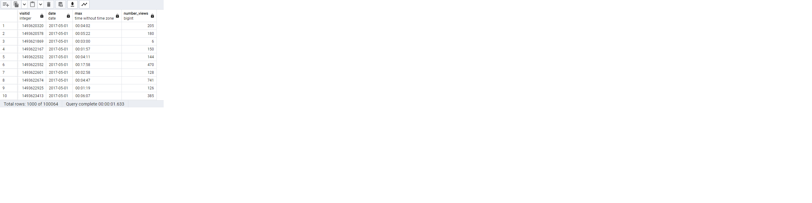
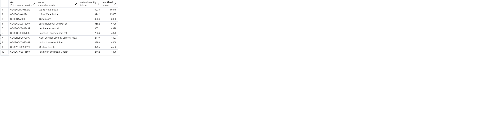

Question 1: What is the maximun amount of time spent onsite and the total number of views per visit ordered by date 

SQL Queries: 
~~~SQL
What is the maximum time spent on site per visit? Does the date tell anything?
SELECT an.visitid, an.date, MAX(an.timeonsite) AS max_time
FROM analytics AS an
WHERE an.timeonsite IS NOT NULL 
GROUP BY an.visitid, an.date
ORDER BY an.date ASC
~~~
Answer: 

The maximun timeonsite is 4 minutes. According to the output people started accessing website as from May 2017 and before that there is no record.

Question 2:  Find which country has the maximun pageviews and what does the result conclude.

SQL Queries:
~~~sql
SELECT DISTINCT als.country, MAX (an.pageviews)AS pageviews
FROM analytics AS an
JOIN all_sessions AS als USING (fullvisitorid)
GROUP BY als.country
ORDER BY pageviews DESC
~~~
Answer: United States has the maximum page views which means the ecommerce website is very popular among americans. Pageviews help measure website traffic and user engagement. The pageviews can provide insights about popular product pages among americans and their website navigation patterns.

Question 3: Are the revenue and timeonsite positively related?

SQL Queries:
~~~sql
SELECT units_sold, timeonsite, revenue
FROM analytics
WHERE revenue IS NOT NULL
ORDER BY timeonsite ASC, revenue ASC

~~~

Answer:
Yes timeonsite is a relevant variable for revenue. As timeonsite increases revenue tends to increase in some cases. But deeper analysis need to be done.

Question 4: List products with their ordered quantities and stock level and explain the pattern

SQL Queries:
~~~sql
SELECT p.sku, p.name, p.orderedquantity,
p.stocklevel
FROM products AS p 
GROUP BY p.sku, p.name, p.orderedquantity,
p.stocklevel
ORDER BY p.stocklevel DESC
LIMIT 10
~~~

Answer:
The stock level is almost in synch with the quantity ordered, meaning that there is always enough in stock to meet customers' demand. The product that has a high stock and demand is water bottle followed by sunglasses.

Question 5:

 Is there any relationship between column all_sessions values with that of sales_by_sku

SQL Queries:
~~~sql
SELECT als.productsku, als.ecommerceaction_type, als.ecommerceaction_step, 
als.V2productname, als.pagetitle, ssku.total_ordered, als.productquantity
FROM all_sessions AS als
JOIN sales_by_sku AS ssku USING (productsku)
ORDER BY ssku.total_ordered DESC
~~~

Answer: This query provides us the total number of items ordered for each product and the corresponding page title the customer visited to make this purchase. I was trying to find some meaning into the ecommerceaction_type and ecommerceaction_step but it seems they do not tell much.
 