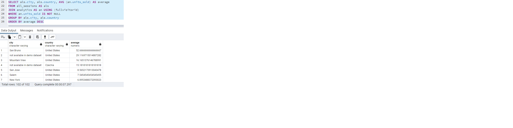
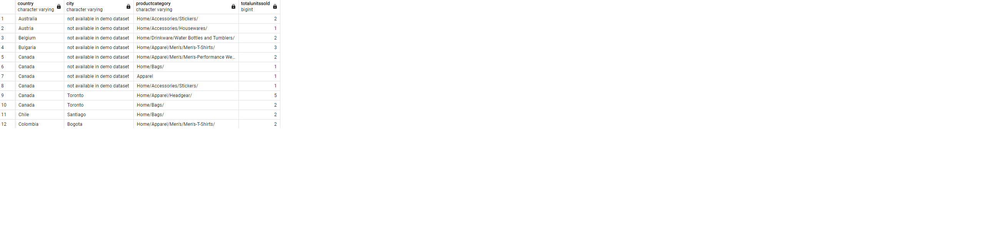
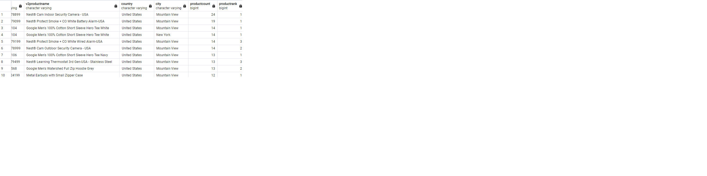
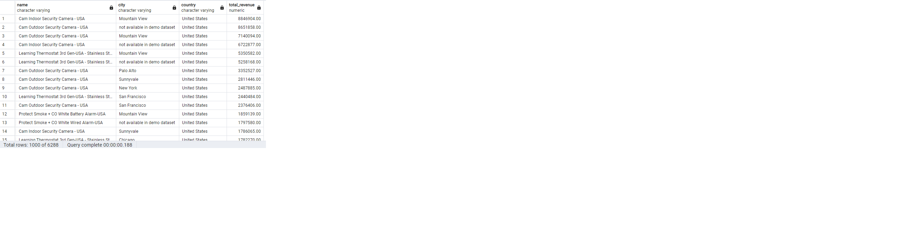

Answer the following questions and provide the SQL queries used to find the answer.

    
**Question 1: Which cities and countries have the highest level of transaction revenues on the site?**

SQL Queries:
~~~sql
SELECT city, country, SUM(totaltransactionrevenue) AS Total_Revenue
FROM all_sessions 
WHERE totaltransactionrevenue IS NOT NULL
GROUP BY city, country
ORDER BY Total_Revenue DESC
LIMIT 10

~~~

Answer: United states/  city (not vailable in demo dataset)=6092.560

**Question 2: What is the average number of products ordered from visitors in each city and country?**

SQL Queries:
~~~SQL
SELECT als.city, als.country, AVG (an.units_sold) AS average
FROM all_sessions AS als
JOIN analytics AS an USING (fullvisitorid)
WHERE an.units_sold IS NOT NULL
GROUP BY als.city, als.country
ORDER BY average DESC
~~~

Answer: 

**Question 3: Is there any pattern in the types (product categories) of products ordered from visitors in each city and country?**

SQL Queries:
~~~SQL
SELECT
    a.country as country,
    a.city as city,
    a.v2productcategory as productcategory,
    SUM(an.units_sold) as totalUnitsSold
FROM all_sessions AS a
JOIN analytics AS an ON a.visitid = an.visitid
JOIN products AS p ON a.productSKU = p.SKU
WHERE a.country != '(not set)'
    AND a.city != '(not set)'
    AND a.v2productcategory != '(not set)'
GROUP BY a.country, a.city, a.v2productcategory
HAVING SUM(an.units_sold) IS NOT NULL
ORDER BY a.country, a.city, totalUnitsSold DESC

~~~

Answer:

It seems there is a pattern in the types of products ordered from visitors, Home/Apparel products being very common.

**Question 4: What is the top-selling product from each city/country? Can we find any pattern worthy of noting in the products sold?**

SQL Queries:
~~~sql
SELECT als.productsku, als.v2productname, als.country, als.city,
                  COUNT(als.productsku) as productcount,
				  RANK() OVER(PARTITION by 
                  COUNT(als.productsku),als.country, als.city 
				  ORDER BY als.productsku) as ranking
FROM all_sessions as als
WHERE als.country !='not available in demo dataset' AND  als.country!='(not set)' AND
als.city !='not available in demo dataset' AND  als.city!='(not set)'
GROUP BY als.productsku,als.v2productname, als.country, als.city
ORDER BY  COUNT(als.productsku) desc;
~~~

Answer:

**Question 5: Can we summarize the impact of revenue generated from each city/country?**

SQL Queries:
~~~SQL
SELECT p.name, als.city, als.country, SUM(als.productprice * p.orderedquantity) AS total_revenue
FROM all_sessions AS als
JOIN products p USING (productsku)
WHERE city IS NOT NULL
AND country IS NOT NULL
GROUP BY  p.name, als.city, als.country
ORDER BY total_revenue DESC
~~~

Answer:

The United States generate the higest amount of revenue from security cameras.  

